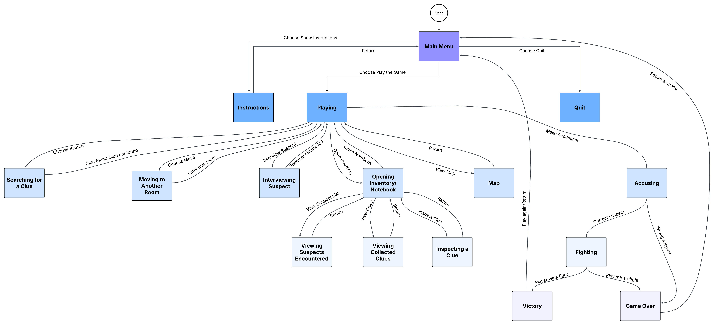
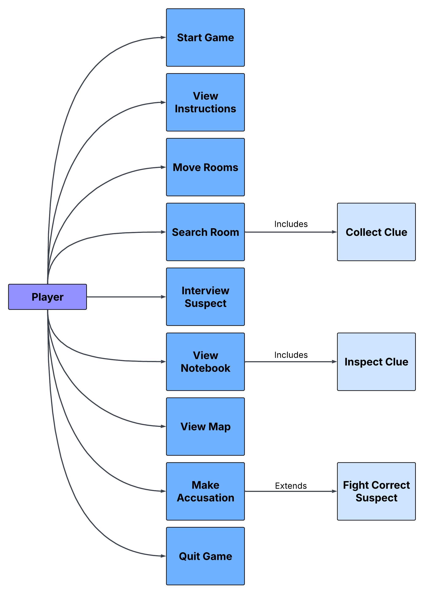

# Clueless: A Classic Murder Mystery Text Adventure (Python)

## Project Overview
This project is an interactive, console-based text adventure game inspired by classic murder mystery mechanics. Built as part of a collaborative computer science group project, the application utilizes algorithmic randomization, object state tracking, and a matrix-style data dictionary to simulate exploring a mansion, interviewing suspects, discovering dynamic clues, and making final accusations.

## Architecture & System Design Models
To ensure logical execution flows and map user engagement pathways before programming, the development lifecycle was structured using formal object-oriented design diagrams.

### 1. State Transition Architecture
The execution engine relies on a strict finite state machine layout to track global player placement, condition branching, and core game loops (e.g., handling transition dependencies between exploring, inventory assessment, and accusation thresholds).

### 2. Behavioral Use Case Modeling
A Unified Modeling Language (UML) behavioral schema maps out user action allowances, dependency inclusion layers (such as extracting clue metrics during standard room searches), and extension states like secondary tactical events upon triggering an accusation.

## Core Technical Features
* **Dynamic Mystery Initialization:** Implements Python's native `random.choice` and `random.sample` algorithms to dynamically select a random killer, generate true evidence vectors, and seed randomized decoy clues across different rooms during each execution.
* **Mansion Matrix Routing:** Engineered a nested dictionary data model mapping 9 separate rooms, their structural descriptions, active clue entities, and directional connectivity trees (`connected_rooms`) to handle independent user movement state metrics.
* **State Tracking and Inventory Logic:** Tracks real-time player states, room variables, notebook arrays, and conditional user options across functional loops.
* **Input-Driven Interface Architecture:** Utilizes continuous `while` loops, console menu validation matrices, and data type coercion to capture player decisions, handle user errors safely, and manage execution flows.

## Collaborators
* JT King
* Kira Almsberger (Core Engine Logic, System Diagrams & State Architecture)
* Shane Mallory
* Marcus Ferguson

## Technologies Used
* **Language:** Python 3
* **Standard Libraries:** `random`
